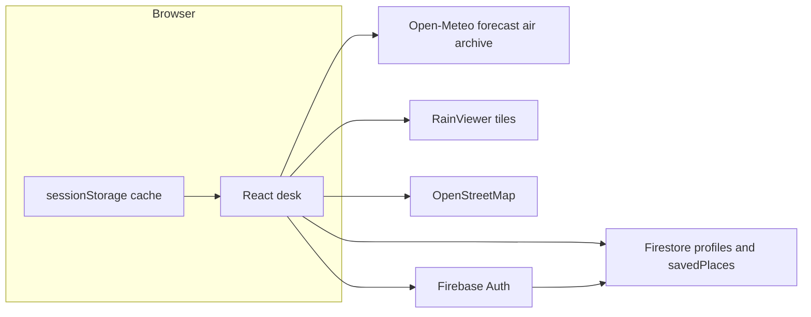

# Viva notes

College Cloud Computing PBL — Weather Monitoring Dashboard (`fir-5baf2`, Spark).

## What to say first

The app is a **login-gated weather desk**. Public weather APIs are fetched **in the browser on demand**. Firebase only stores **who may use the app** and **their places**. Alerts are **computed locally**. They are **not** an official IMD / NWS warning feed.

## Architecture

- **Frontend:** Vite, React 19, React Router 7.
- **Auth / data:** Firebase Auth + Firestore on Spark. No Cloud Functions, no Blaze.
- **Hosting:** Firebase Hosting (`https://fir-5baf2.web.app`).
- **Default home:** Pune `18.52, 73.86`. `locationId` is `lat,lon` at two decimal places.

## On-demand vs scheduled

| On-demand (what the desk uses) | Scheduled (legacy / optional) |
| --- | --- |
| Dashboard / Map / History call Open-Meteo when you open them | GitHub Action can still write `readings` |
| Cache: 10 min forecast, 5 min radar, 60 min archive | Useful to explain “compute in the cloud” |
| No weather API key in the client | Needs Actions secrets + Admin SDK |

If asked “where is the cloud compute?”: **Firebase Auth, Firestore, and Hosting** are the cloud services. Weather compute is a **public HTTPS API** called from the client. Spark cannot run Cloud Functions.

## Access control vs public weather

Weather tiles and JSON are public. The **app** is not.

- Landing is public. `/app/*` needs a signed-in, **approved** user.
- `approvedEmails/{email}` is the invite list.
- `userProfiles/{uid}` is readable by the owner or an admin. Members cannot change `role`.
- `savedPlaces` are per-user, cap 20, coordinates validated in rules.
- Admin directory and Status stay behind `AdminRoute`.

## Licences and attribution

| Source | Licence / terms | Used for |
| --- | --- | --- |
| [Open-Meteo](https://open-meteo.com/) | CC BY 4.0 | Forecast, air quality, archive |
| [RainViewer](https://www.rainviewer.com/) | Their map API terms | Radar tiles on `/app/map` |
| [OpenStreetMap](https://www.openstreetmap.org/copyright) | ODbL | Base map |
| Leaflet 1.9 | BSD-2-Clause | Map UI |

The footer repeats this so a demo does not look like we collected the observations ourselves.

## Alerts (say this out loud)

`evaluateAlerts` flags heat (>40 °C), cold (<5 °C), thunderstorm WMO codes 95/96/99, and US AQI ≥ 151.

- Shown as banners on the dashboard.
- If Settings → Notifications is on **and** the browser granted permission **and** the tab is visible, `Notification` fires **once per alert id**.
- Closing the tab stops notifications. This is not a push service and not official warnings.

## Navigation

- Desktop: 220 px sidebar.
- Compact (≤1100 px): bottom tabs Dashboard / Map / History / Settings. Menu drawer still reaches Admin / Status for admins.

## History and CSV

History uses the Open-Meteo **archive** API for the **home** place. Default range is the last 7 days ending two UTC days ago (archive lag). Max 366 days; end date cannot be today. CSV downloads the rows on screen.

## Bundle note (`npm run build`, 2026-10-05)

| File | Raw | Gzip |
| --- | ---: | ---: |
| `index.html` | 0.42 kB | 0.29 kB |
| `index-*.css` | 15.40 kB | 3.96 kB |
| `PlaceMap-*.css` (Leaflet) | 15.61 kB | 6.46 kB |
| `WeatherTrendChart-*.js` | 1.81 kB | 0.78 kB |
| `ArchiveChart-*.js` | 1.84 kB | 0.79 kB |
| `MapPage-*.js` | 5.09 kB | 2.22 kB |
| `HistoryPage-*.js` | 5.71 kB | 2.42 kB |
| `PlaceMap-*.js` (Leaflet) | 158.30 kB | 49.91 kB |
| `LineChart-*.js` (Recharts) | 393.71 kB | 108.15 kB |
| `index-*.js` (app + Firebase) | 792.16 kB | 212.04 kB |

Map, History, and charts stay on `lazy()` routes. The 500 kB warning is the main Firebase + React chunk. That is expected on Spark with the official web SDK.

## Likely viva questions

1. **Why no Cloud Functions?** Spark plan; scheduled ingest would need Blaze or GitHub Actions.
2. **Why not store every forecast in Firestore?** Quota and cost. Cache in the browser; persist only profile + saved pins.
3. **Is Open-Meteo “your” data?** No. We attribute CC BY 4.0.
4. **How do you stop a classmate creating an account?** They can register in Auth, but rules and `RequireAuth` send unapproved emails to `/not-approved`.
5. **Can a member make themselves admin?** No. Rules lock `role` on update.
